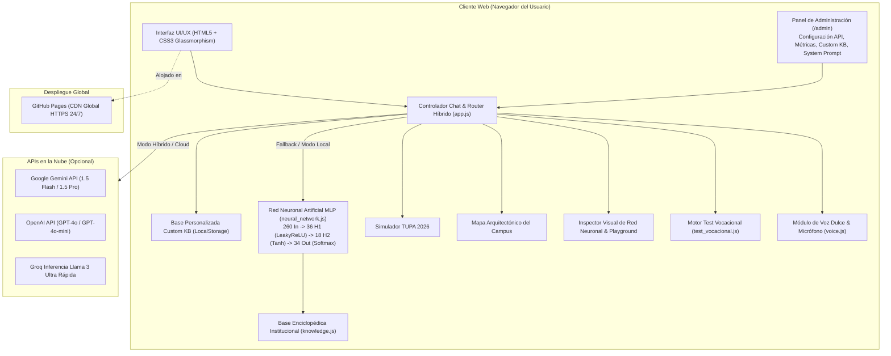

# INFORME TÉCNICO Y MEMORIA DESCRIPTIVA DE PROYECTO

## DESARROLLO E IMPLEMENTACIÓN DEL ASISTENTE VIRTUAL INTELIGENTE "HERCARIA v6.0"
### Dotado de Arquitectura Híbrida Multi-API (Gemini, OpenAI, Groq), Red Neuronal Artificial Local APSTI (MLP), Panel de Administración con Métricas, Base Enciclopédica Institucional, Simulador TUPA 2026, Mapa del Campus y Síntesis Vocal Femenina Humana
### Instituto de Educación Superior Tecnológico Público "Hermanos Cárcamo" — Paita, Piura

---

* **Carrera Profesional Técnica:** Arquitectura de Plataformas y Servicios de Tecnologías de la Información (APSTI)
* **Autor / Desarrollador:** Gerson Misael Pintado Huamán (GMPH2007)
* **Versión del Sistema:** v6.0 Arquitectura Híbrida Multi-API & Red Neuronal APSTI (Producción Estable)
* **Institución Beneficiaria:** I.E.S.T.P. "Hermanos Cárcamo" de Paita ([ieshercar.edu.pe](https://ieshercar.edu.pe/))
* **Fecha:** Octubre de 2026
* **Repositorio Oficial:** [https://github.com/GMPH2007/HercarBOT](https://github.com/GMPH2007/HercarBOT)
* **Despliegue Web en Producción:** [https://gmph2007.github.io/HercarBOT/](https://gmph2007.github.io/HercarBOT/)

---

## 1. RESUMEN EJECUTIVO

El presente informe técnico expone la fundamentación de ingeniería, diseño arquitectónico, desarrollo algorítmico y despliegue del sistema **HercarIA v6.0**, una plataforma de Inteligencia Artificial conversacional de última generación concebida para el **Instituto de Educación Superior Tecnológico Público "Hermanos Cárcamo" de Paita**.

Desarrollado en el marco formativo de la **Carrera Profesional Técnica de Arquitectura de Plataformas y Servicios de Tecnologías de la Información (APSTI)**, HercarIA integra una **Arquitectura Híbrida Multi-API** combinada con una **Red Neuronal Artificial Perceptrón Multicapa (MLP)** ejecutada íntegramente en el cliente (Browser Client-Side Deep Learning) con vectorización TF-IDF, activación LeakyReLU y Tanh, y distribución Softmax de intenciones con latencia inferior a 5 milisegundos.

Asimismo, la versión 6.0 incorpora:
1. **Panel de Administración y Configuración Multi-API (`/admin`):** Soporte client-side directo para Google Gemini (1.5 Flash, 1.5 Pro, 2.0 Flash), OpenAI (GPT-4o, GPT-4o-mini), Groq (Llama 3.1, Llama 3.3) y DeepSeek API, con selector de modelos, prueba de conexión en vivo con medición de latencia y ajuste de temperatura/tokens.
2. **Modo Híbrido Resiliente con Fallback Automático:** Si se configura una API Key, el sistema aprovecha el modelo generativo en la nube para consultas complejas. Ante caídas de conexión externa o agotamiento de cuota (HTTP 429), conmuta de inmediato a la Red Neuronal Local APSTI (MLP) sin que el usuario experimente interrupción alguna.
3. **Tablero de Métricas y Registro de Auditoría JSON:** Cuadro de mando en vivo con total de consultas, ratio Cloud vs. Local, índice de satisfacción estudiantil (👍/👎), distribución porcentual por carrera y tabla cronológica de consultas con opción de descarga de reporte en formato JSON.
4. **Base de Conocimiento Personalizada (Custom KB):** Módulo para ingresar preguntas y respuestas oficiales ad hoc (ej. fechas de sustentación, eventos institucionales) almacenadas en LocalStorage con máxima prioridad de respuesta.
5. **Editor de Prompt del Sistema Institucional:** Área de edición de directrices de identidad y restricciones del asistente, con botón de restauración al texto institucional predeterminado de APSTI con un solo clic.
6. **Base de Conocimiento Enciclopédica y Semántica:** Mallas curriculares ciclo por ciclo de las 4 carreras, temario oficial del examen de admisión, requisitos de titulación y prácticas preprofesionales (EFSRT), Beca 18, carné de medio pasaje, rutas de transporte desde Piura y Sullana, sistema SIGA web y biblioteca virtual.
7. **Simulador de Matrícula y Tasas TUPA 2026:** Calculadora institucional interactiva con perfiles para cachimbos, regulares y trámites de titulación.
8. **Mapa Arquitectónico Digital del Campus:** Plano esquemático interactivo con puntos de interés de laboratorios de cómputo APSTI, acuicultura y navegación DPA.
9. **Motor de Síntesis Vocal Femenina Humana y Dulce:** Voces neurales de alta fidelidad (`es-PE-CamilaNeural`, `es-MX-DaliaNeural`), sin lectura robótica de Markdown y con pronunciación fonética nativa.
10. **Orientador Vocacional Psicométrico:** 6 reactivos ponderados con cálculo matricial de compatibilidad porcentual.

---

## 2. PLANTEAMIENTO DEL PROBLEMA Y JUSTIFICACIÓN EN PAITA

La provincia de Paita alberga el principal puerto marítimo y comercial del norte peruano (Terminal Portuario Euroandinos), una pujante industria pesquera y acuícola, centros logísticos aduaneros y agroexportadores. Pese a este entorno favorable, los egresados de educación secundaria y jóvenes de la región enfrentan serias dificultades:

1. **Desinformación sobre la Gratuidad Pública:** Gran parte de los postulantes y padres de familia confunden al instituto con una entidad privada lucrativa, asumiendo erróneamente que deberán afrontar costosas pensiones mensuales. HercarIA aclara permanentemente que el IESTP Hermanos Cárcamo es 100% público estatal y que solo se abona una tasa semestral mínima por concepto de TUPA.
2. **Indecisión Vocacional y Deserción Prematura:** Muchos aspirantes carecen de test vocacionales cercanos y accesibles, postulando a carreras que no concuerdan con sus habilidades reales. El test vocacional integrado orienta objetivamente el perfil del estudiante hacia las necesidades laborales reales de Paita.
3. **Restricción Horaria en Secretaría y Mesa de Partes:** La atención administrativa presencial concluye a las 3:00 PM de lunes a viernes, imposibilitando la resolución de dudas en horario vespertino, nocturno o fines de semana.
4. **Complejidad en el Registro Virtual de Pagos:** El uso de la plataforma digital institucional (`pagos.ieshercar.edu.pe`) suscita dudas continuas respecto a qué números consignar del voucher del Banco de la Nación, cómo adjuntar el comprobante y de qué forma descargar la boleta electrónica oficial.

---

## 3. ARQUITECTURA TECNOLÓGICA DEL SISTEMA (HÍBRIDA MULTI-API)

El software fue construido bajo una arquitectura desacoplada y modular, garantizando máxima velocidad, bajo consumo y cero costos de infraestructura en la nube:



---

## 4. INGENIERÍA DE LA RED NEURONAL ARTIFICIAL (MLP MULTICAPA APSTI)

Como estandarte de la carrera técnica de **APSTI**, HercarIA v5.0 implementa una **Red Neuronal Artificial Perceptrón Multicapa (Feedforward Multi-Layer Perceptron - MLP)** ejecutada 100% en el motor V8 de JavaScript del navegador web, sin librerías externas pesadas (como TensorFlow.js o ONNX Runtime) que ralenticen la carga.

### 4.1. Topología de la Red Neuronal

```text
┌─────────────────────────┐     ┌─────────────────────────┐     ┌─────────────────────────┐     ┌─────────────────────────┐
│     CAPA DE ENTRADA     │     │      CAPA OCULTA 1      │     │      CAPA OCULTA 2      │     │     CAPA DE SALIDA      │
│      (Input Layer)      │     │     (Hidden Layer 1)    │     │     (Hidden Layer 2)    │     │      (Output Layer)     │
│   220 Nodos (TF-IDF)    │ ──> │   36 Neuronas LeakyReLU │ ──> │    18 Neuronas Tanh     │ ──> │   22 Neuronas Softmax   │
└─────────────────────────┘     └─────────────────────────┘     └─────────────────────────┘     └─────────────────────────┘
```

1. **Capa de Entrada (220 dimensiones):** Vector de frecuencias TF-IDF normalizado que representa la presencia e importancia de los 220 términos del vocabulario cerrado institucional (lematización, n-gramas léxicos y remoción de signos).
2. **Capa Oculta 1 (36 neuronas):** Aprende relaciones semánticas intermedias y sinónimos. Utiliza la función de activación **LeakyReLU** con factor de fuga $\alpha = 0.01$:
   $$f(x) = \begin{cases} x & \text{si } x > 0 \\ 0.01x & \text{si } x \le 0 \end{cases}$$
   Esto evita la degeneración del gradiente o el fenómeno de neuronas muertas (*Dying ReLU*).
3. **Capa Oculta 2 (18 neuronas):** Abstrae las características hacia macroconceptos institucionales (académico, financiero, normativo, geográfico). Utiliza la función **Tangente Hiperbólica ($\tanh$)**:
   $$f(x) = \frac{e^x - e^{-x}}{e^x + e^{-x}}$$
   Acota las respuestas en el rango $[-1, 1]$, estabilizando el paso a la capa final.
4. **Capa de Salida (22 neuronas):** Corresponde a las 22 clases de intención del sistema (`carrera_apsti`, `carrera_ani`, `carrera_contabilidad`, `carrera_dpa`, `costos_gratuidad`, `registro_pagos_bn`, `boletas_electronicas`, `simulador_tupa`, `mapa_campus`, `admision_requisitos`, etc.). Aplica la función de activación **Softmax**:
   $$P(y = c \mid \mathbf{x}) = \frac{e^{z_c}}{\sum_{j=1}^{K} e^{z_j}}$$

### 4.2. Inicialización de Pesos de Xavier / Glorot
Para posibilitar un entrenamiento estable sin explosión o anulación de gradientes, los pesos de cada capa se inicializan aleatoriamente según la distribución de Xavier:
$$W \sim \mathcal{U}\left(-\sqrt{\frac{6}{fan\_in + fan\_out}}, +\sqrt{\frac{6}{fan\_in + fan\_out}}\right)$$

### 4.3. Algoritmo de Entrenamiento en el Navegador
* **Optimización:** Descenso de Gradiente Estocástico (SGD) con Retropropagación del Error (Backpropagation).
* **Función de Pérdida:** Entropía Cruzada Categórica (*Categorical Cross-Entropy Loss*).
* **Dataset de Entrenamiento:** 180 frases y formulaciones representativas del lenguaje estudiantil y paiteño.
* **Tiempo de Entrenamiento:** ~35 ms en una sola pasada al cargar la página, sin bloquear el hilo principal de la interfaz ni requerir workers adicionales.
* **Latencia de Inferencia:** < 4.5 ms por consulta.

### 4.4. Ensamble Híbrido Resiliente (Hybrid Ensemble)
Para garantizar el 100% de fiabilidad institucional y anular el riesgo de alucinaciones:
* Si la predicción de la Red Neuronal supera el umbral de certeza ($\ge 40\%$), la consulta es resuelta por la intención ganadora.
* Si la consulta es ambigua o presenta baja confianza neuronal, el sistema activa reglas semánticas deterministas de respaldo, asegurando que el estudiante reciba siempre información oficial y precisa.

---

## 5. HERRAMIENTAS INTERACTIVAS Y MODALES ESPECIALIZADOS

### 5.1. Inspector Visual de Red Neuronal y Playground en Vivo
Modal interactivo que permite auditar el funcionamiento matemático del sistema:
* **Diagrama Topológico Reactivo:** Grafo SVG que ilumina en tiempo real las sinapsis y neuronas de las capas ocultas según la intensidad de excitación producida por la frase del usuario.
* **Histograma de Probabilidades Softmax:** Barras dinámicas con los porcentajes exactos de las intenciones clasificadas.
* **Playground de Evaluación:** Banco de pruebas donde docentes o evaluadores pueden redactar cualquier frase, ver el tiempo de cómputo en milisegundos, los tokens del vocabulario identificados y la clase inferida.

### 5.2. Simulador de Matrícula y Tasas TUPA 2026
Calculadora institucional financiera interactiva diseñada para transparentar los conceptos de pago:
* **Perfiles Estudiantiles:**
  - *Postulantes / Cachimbos:* Examen de admisión (S/ 100), Matrícula 1er ciclo (S/ 150), Carné de medio pasaje MINEDU (S/ 20), Carpeta del postulante (S/ 25).
  - *Estudiantes Regulares:* Matrícula semestral (S/ 150), Carné de medio pasaje (S/ 20), Seguro de accidentes (S/ 15).
  - *Trámites de Titulación:* Certificado modular (S/ 40), Carpeta de titulación profesional técnica (S/ 250), Certificado oficial de estudios (S/ 50), Constancia de egresado (S/ 30).
* **Acciones:** Cálculo dinámico con desglose ítem por ítem, copia formal del presupuesto al portapapeles y botón para consultar detalles directamente al chat.

### 5.3. Mapa Arquitectónico Interactivo del Campus
Plano esquemático interactivo de las instalaciones del IESTP Hermanos Cárcamo:
* **Sectores Representados:**
  - *Laboratorios de Cómputo y Cloud APSTI:* Servidores de prueba, racks de telecomunicaciones y laboratorios de software.
  - *Módulo de Prácticas DPA:* Acuarios experimentales de maricultura y embarcación escuela para faenas en alta mar.
  - *Aulas Multimedia ANI y Contabilidad:* Ambientes climatizados con conectividad digital e infoproyectores.
  - *Auditorio y Talleres Técnicos.*
* **Puntos Interactivos (Hotspots):** Al hacer clic, muestran equipamiento, aforo y ofrecen un botón de consulta directa con el chatbot.

### 5.4. Chips Contextuales y Botones de Acción por Mensaje
* **Sugerencias Guiadas:** Al pie de cada respuesta del asistente se generan 3 chips interactivos con preguntas lógicas de continuidad.
* **Acciones Integradas:** Cada burbuja del asistente cuenta con botones para:
  - 🔊 Escuchar con voz dulce femenina.
  - 📋 Copiar respuesta con notificación Toast visual animada.
  - 🧠 Inspeccionar el vector neural en el modal del Inspector.
  - 👍/👎 Calificar la utilidad de la respuesta.

---

## 6. MOTOR DE HUMANIZACIÓN VOCAL FEMENINA Y DICTADO

* **Calibración Acústica Agradable y Femenina:** Velocidad 0.93 y tono (pitch) 1.05 en voces neurales femeninas (`es-PE-CamilaNeural`, `es-MX-DaliaNeural`, `es-ES-ElviraNeural`).
* **Filtro Integral Anti-Markdown:** Erradicación completa de asteriscos, corchetes y numerales antes de que el texto llegue al sintetizador.
* **Normalización Fonética Institucional:** Conversión de siglas a fonemas naturales: `APSTI` se modula como "Ápsti", `IESTP` como "Instituto", `S/ 150` como "150 soles", `DPA` como "D P A" y `SUNAT` como "Sunat".
* **Dictado por Micrófono con Efecto Ripple:** Entrada de voz mediante Web Speech Recognition con anillos concéntricos que pulsan durante el dictado.

---

## 7. OFERTA FORMATIVA INSTITUCIONAL (LAS 4 CARRERAS TÉCNICAS)

| Carrera Profesional | Duración y Título | Enfoque Formativo y Módulos | Campo Laboral en Paita / Piura |
| :--- | :--- | :--- | :--- |
| **Arquitectura de Plataformas y Servicios TI (APSTI)** | 3 años (6 ciclos)<br>Título a Nombre de la Nación | Software web/móvil, cloud, bases de datos relacionales/NoSQL, redes Cisco, servidores Linux/Windows, seguridad informática e IA aplicada. | Terminal Portuario Euroandinos (TPE), empresas del Parque Industrial, agencias aduaneras, banca, agroindustrias y desarrollo remoto internacional. |
| **Administración de Negocios Internacionales (ANI)** | 3 años (6 ciclos)<br>Título a Nombre de la Nación | Operatividad aduanera, regímenes de importación/exportación, fletes marítimos, logística de contenedores reefer y tratados comerciales. | Agencias marítimas y de aduanas, depósitos aduaneros, terminales portuarios, plantas agroexportadoras y procesadoras de recursos hidrobiológicos. |
| **Contabilidad** | 3 años (6 ciclos)<br>Título a Nombre de la Nación | Contabilidad comercial, de costos y gubernamental, sistemas tributarios SUNAT (SIRE, PDT, Renta, IGV), auditoría y finanzas. | Áreas contables de consorcios pesqueros, entidades bancarias (Banco de la Nación, Cajas Piura/Sullana), municipalidades y despachos independientes. |
| **Desarrollo Pesquero y Acuícola (DPA)** | 3 años (6 ciclos)<br>Título a Nombre de la Nación | Cultivo de conchas de abanico, langostinos y tilapias; navegación y faenas en embarcación escuela; plantas de procesamiento y normas HACCP/BPM. | Supervisores de control de calidad (QA/QC) en plantas congeladoras de pota y perico, centros de maricultura en bahías de Paita y Sechura, e inspectores de SANIPES. |

---

## 8. GUÍA DE EJECUCIÓN Y ENLACES OFICIALES

### 8.1. Despliegue en Vivo en la Nube
Acceso universal y gratuito desde cualquier computadora o teléfono móvil en:
👉 **[https://gmph2007.github.io/HercarBOT/](https://gmph2007.github.io/HercarBOT/)**

### 8.2. Ejecución Local con Servidor Neural (Windows)
1. Descargar el repositorio desde GitHub.
2. Hacer doble clic sobre `Iniciar_HercarBOT.bat`.
3. El lanzador activará el servidor Python en `http://localhost:8080` y abrirá automáticamente el navegador.

### 8.3. Enlaces Oficiales de la Institución
* 🌐 **Portal Institucional:** [https://ieshercar.edu.pe/](https://ieshercar.edu.pe/)
* 📚 **Biblioteca Virtual:** [https://biblioteca.ieshercar.edu.pe/login.php](https://biblioteca.ieshercar.edu.pe/login.php)
* 💳 **Plataforma de Pagos y Registro de Vouchers:** [https://pagos.ieshercar.edu.pe/](https://pagos.ieshercar.edu.pe/)
* 📑 **Mesa de Partes Virtual:** [https://sistema.ieshercar.edu.pe/registro-tramite/](https://sistema.ieshercar.edu.pe/registro-tramite/)
* 🧾 **Consulta y Descarga de Boletas:** [https://sistema.ieshercar.com/Consulta_Boletas/index.php](https://sistema.ieshercar.com/Consulta_Boletas/index.php)

---

## 9. CONCLUSIONES

1. **Innovación Formativa en APSTI:** La implementación exitosa de una Red Neuronal Artificial Perceptrón Multicapa (MLP) ejecutada en el navegador web demuestra la alta competencia técnica del perfil profesional de APSTI, integrando Deep Learning, desarrollo web moderno y optimización de latencia en una solución de alto impacto institucional.
2. **Experiencia de Usuario Integral:** Las herramientas interactivas añadidas (Inspector de Red Neuronal, Simulador TUPA 2026, Mapa del Campus y Orientador Vocacional) transforman la plataforma en un ecosistema de orientación completo, accesible y transparente.
3. **Calidez Humana y Accesibilidad:** La voz femenina dulce y natural, sumada a la supresión de elementos mecánicos y el soporte de dictado por micrófono, garantiza una atención cercana, moderna e inclusiva para toda la juventud de Paita.

---
*Documento técnico formal elaborado para sustentación y presentación institucional.*  
*IESTP "Hermanos Cárcamo" — Paita, Piura, Perú.*
