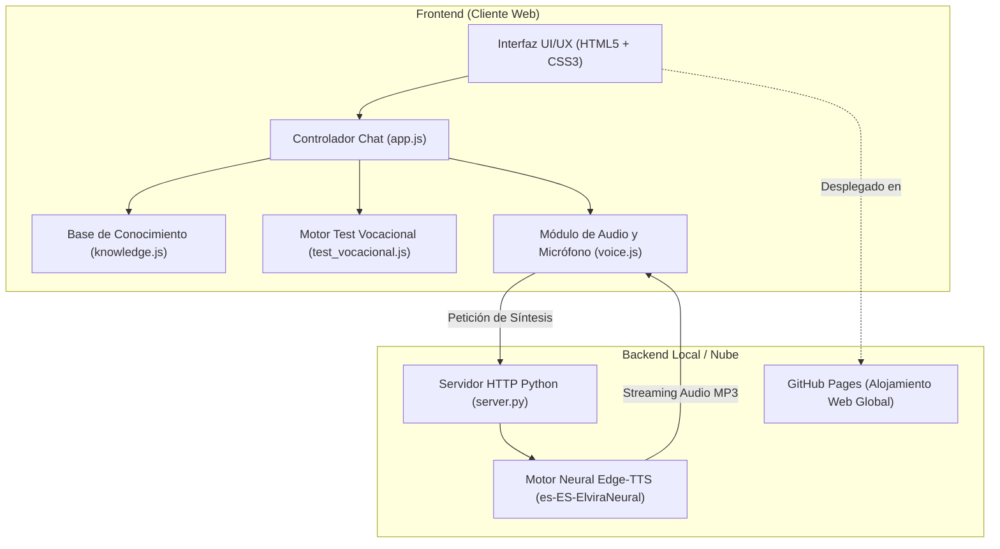

# INFORME TÉCNICO Y MEMORIA DESCRIPTIVA DE PROYECTO

## DESARROLLO E IMPLEMENTACIÓN DEL ASISTENTE VIRTUAL INTELIGENTE Y ORIENTADOR VOCACIONAL "HERCARIA"
### Instituto de Educación Superior Tecnológico Público "Hermanos Cárcamo" — Paita, Piura

---

* **Autor / Desarrollador:** Gerson Misael Pintado Huamán (GMPH2007)
* **Institución Beneficiaria:** I.E.S.T.P. "Hermanos Cárcamo" de Paita ([ieshercar.edu.pe](https://ieshercar.edu.pe/))
* **Fecha:** Septiembre de 2026
* **Repositorio Oficial:** [https://github.com/GMPH2007/HercarBOT](https://github.com/GMPH2007/HercarBOT)
* **Despliegue Web en Producción:** [https://gmph2007.github.io/HercarBOT/](https://gmph2007.github.io/HercarBOT/)

---

## 1. RESUMEN EJECUTIVO

El presente documento detalla la concepción, diseño arquitectónico, desarrollo técnico, pruebas de despliegue y puesta en producción de **HercarIA**, un agente conversacional inteligente (Chatbot) con interfaz gráfica moderna en pantalla completa estilo ChatGPT, dotado de un motor de orientación vocacional interactivo, síntesis de voz femenina neural de alta fidelidad, reconocimiento de voz (Speech-to-Text) y una base de conocimientos exhaustiva sobre el **I.E.S.T.P. "Hermanos Cárcamo" de Paita**.

El proyecto surge para resolver la brecha informativa que experimentan los egresados de educación secundaria y la comunidad estudiantil de Paita y Piura, quienes frecuentemente carecen de orientación oportuna para elegir su carrera técnica profesional, desconocen la gratuidad de la enseñanza en los institutos públicos del Estado, o presentan dificultades en el registro virtual de sus comprobantes de pago en la plataforma institucional.

---

## 2. PLANTEAMIENTO DEL PROBLEMA Y JUSTIFICACIÓN

### 2.1. Diagnóstico de la Situación Actual
1. **Indecisión Vocacional:** Una gran proporción de postulantes no cuenta con orientación vocacional temprana y desconoce las oportunidades laborales y el perfil de las carreras técnicas demandadas en el puerto de Paita.
2. **Atención Limitada en Ventanilla:** La secretaría académica atiende en horario regular de oficina (lunes a viernes de 8:00 AM a 3:00 PM), dejando desatendidas las consultas en horarios nocturnos, fines de semana o de personas que viven lejos del campus.
3. **Desinformación sobre Costos:** Muchos aspirantes confunden los institutos tecnológicos públicos con entidades privadas, ignorando que la enseñanza en el IESTP Hermanos Cárcamo es **100% gratuita** y que solo se abona una tasa administrativa semestral estipulada en el TUPA.
4. **Curva de Aprendizaje en Trámites Digitales:** El registro de comprobantes bancarios en el portal `pagos.ieshercar.edu.pe` genera consultas reiterativas sobre qué datos ingresar (número de operación, fecha, monto) y cómo obtener la boleta electrónica.

### 2.2. Solución Propuesta
Crear un sistema digital autónomo, disponible las 24 horas del día, los 7 días de la semana, accesible desde computadoras o teléfonos móviles, con una interfaz atractiva, capacidad auditiva y vocal en español, y un test vocacional de 6 factores capaz de orientar al estudiante de forma amena y pedagógica.

---

## 3. ARQUITECTURA TECNOLÓGICA DEL SISTEMA

El software fue construido bajo una arquitectura desacoplada y modular, garantizando alta velocidad de carga, bajo consumo de recursos y total portabilidad:



### 3.1. Stack Tecnológico Seleccionado

| Componente | Tecnología | Justificación Técnica |
| :--- | :--- | :--- |
| **Frontend Core** | HTML5 Semántico + JavaScript Moderno (ES6+) | Máximo rendimiento sin sobrecargas de frameworks pesados, carga instantánea y compatibilidad universal en navegadores. |
| **Estilos & Diseño** | CSS3 Avanzado (Variables CSS, Flexbox, CSS Grid) | Diseño responsivo fluido, transiciones a 60 FPS, soporte nativo de Modo Oscuro / Claro y efecto Ripple en interacciones. |
| **Iconografía** | Vectores SVG Inline (Phosphor / Feather Standard) | Eliminación de emojis informales, trazo consistente de 2px, nitidez infinita sin pixelación y peso mínimo (menos de 2 KB). |
| **Backend & TTS** | Python 3.11 + `edge-tts` + `http.server` | Síntesis vocal neural con calidad de estudio en español (`es-ES-ElviraNeural`) sin necesidad de pagar costosas licencias de APIs externas. |
| **Reconocimiento de Voz** | Web Speech API (`webkitSpeechRecognition`) | Permite a los usuarios hablar directamente al sistema con el micrófono, transcribiendo a texto en tiempo real con dialecto peruano (`es-PE`). |
| **Alojamiento & CD** | Git + GitHub + GitHub Pages | Control de versiones profesional, repositorio público y distribución global mediante CDN HTTPS de alta velocidad. |

---

## 4. FASES METODOLÓGICAS DE DESARROLLO

El desarrollo se ejecutó en 7 etapas rigurosas:

### Fase 1: Extracción y Modelado del Conocimiento Institucional
* Se analizó la estructura del sitio oficial del instituto (`https://ieshercar.edu.pe/`), subplataformas (`pagos.ieshercar.edu.pe`, `sistema.ieshercar.edu.pe`), comunicados, TUPA y resoluciones ministeriales de creación (R.M. N° 232-87-ED y R.M. N° 0528-2006-ED).
* Se redactó la base de datos JavaScript estructurada ([`js/knowledge.js`](file:///c:/Users/misae/Downloads/HercarBOT%20O%20CHAT%20BOT%20HERCAR/js/knowledge.js)) que contiene la información completa de:
  - Las 4 carreras técnicas profesionales (APSTI, ANI, Contabilidad, DPA), sus perfiles de egreso, módulos de certificación anual y justificación laboral en el puerto de Paita.
  - Proceso de matrícula, costos TUPA y la gratuidad de la enseñanza pública.
  - Guía detallada para depósito en Banco de la Nación y validación digital de vouchers.
  - Historia del instituto, los héroes hermanos Cárcamo (1821) y el megaproyecto de modernización de S/ 36 millones del GORE Piura (que incluye una embarcación pesquera moderna equipada para prácticas en el mar).

### Fase 2: Diseño de Experiencia de Usuario (UI/UX)
* Se diseñó una interfaz en pantalla completa con diseño inspirado en ChatGPT, incorporando la identidad cromática del instituto:
  - **Azul Marino Institucional (`#13357b`):** Transmite seriedad, rigor académico y tradición paiteña.
  - **Dorado / Ámbar (`#f59e0b`):** Evoca excelencia, liderazgo y logros de titulación.
  - **Azul Eléctrico (`#2563eb`):** Modernidad y avance tecnológico.
* **Portada de Bienvenida Centrada:** Diseñada a modo de Landing Page interactiva que recibe al usuario con la pregunta: *"¿Qué deseas consultar hoy?"* y 6 tarjetas organizadas con elevación sutil mediante sombras (`box-shadow`), eliminando bordes perimetrales amarillos toscos.
* **Sidebar Minimalista:** Se removió la saturación de botones individuales de carreras, dejando únicamente las acciones clave: *Inicio*, *Test Vocacional*, *Consultas Frecuentes* y *Modo Oscuro*.

### Fase 3: Algoritmo del Test Vocacional Interactivo
* Se estructuró un motor psicométrico vocacional ([`js/test_vocacional.js`](file:///c:/Users/misae/Downloads/HercarBOT%20O%20CHAT%20BOT%20HERCAR/js/test_vocacional.js)) basado en 6 reactivos interactivos:
  1. *Intereses y Pasiones*
  2. *Habilidades y Destrezas*
  3. *Ambiente Laboral Soñado*
  4. *Materias de Preferencia*
  5. *Solución de Retos Prácticos*
  6. *Meta Profesional a 3 Años*
* Cada respuesta suma ponderaciones a las 4 carreras oficiales. Al concluir, el sistema calcula porcentajes relativos, renderiza una tarjeta con trofeo, indica la carrera ganadora con su porcentaje de afinidad, destaca una opción secundaria y ofrece botones directos para consultar la malla o requisitos de matrícula.

### Fase 4: Implementación del Motor de Inteligencia (NLP)
* Se implementó en [`js/app.js`](file:///c:/Users/misae/Downloads/HercarBOT%20O%20CHAT%20BOT%20HERCAR/js/app.js) un procesador de lenguaje natural capaz de normalizar texto (remoción de diacríticos y puntuación), resolver errores tipográficos comunes ("amtriucla", "carrea", "apsti", "boucher", "pesqueria") y clasificar la intención del usuario en 12 categorías semánticas.
* El formateador traduce sintaxis Markdown (encabezados, listas, negritas, enlaces seguros con icono indicador y bloques de alerta) a HTML sanitizado.

### Fase 5: Módulo de Audio, Síntesis Femenina Neural Peruana y Antirruido
* **Voz Femenina Camila (`es-PE-CamilaNeural`):** Se adoptó como estándar principal la voz neural peruana de Microsoft Edge TTS, dotando al asistente de un tono dulce, natural y con articulación regional auténtica para Paita y Piura.
* **Normalización Fonética Avanzada:** Se implementó en [`js/voice.js`](file:///c:/Users/misae/Downloads/HercarBOT%20O%20CHAT%20BOT%20HERCAR/js/voice.js) un diccionario fonético que reemplaza siglas como `I.E.S.T.P.` por "Instituto", `S/ 150` por "150 soles", y deletrea siglas como `APSTI` ("A P S T I"), impidiendo que los puntos de las abreviaturas corten el habla de la inteligencia artificial.
* **Segmentación con Expresiones Regulares:** Las oraciones se agrupan mediante regex (`/[^.!?]+[.!?]+/g`) hasta un límite equilibrado de 320 caracteres, permitiendo alocuciones fluidas y naturales.
* **Control de Audio Profesional:** El botón de la cabecera se renombró sobriamente a **"Voz"** (con punto de estado verde/rojo y popover desplegable para alternar entre Camila, Dalia, Elvira y navegador), ofreciendo una apariencia seria y académica para presentaciones institucionales.
* **Silenciamiento Instantáneo:** Detención inmediata del audio pulsando la tecla `Escape`, enfocando el recuadro de texto o activando el micrófono.

### Fase 6: Sistema de Control de Conversación y Navegación Adaptativa
* **Menú Responsivo de 3 Líneas:** 
  - En **Desktop**: El botón de 3 líneas colapsa el menú lateral (`margin-left: -280px`), permitiendo que el área de chat se expanda al 100% del ancho de la pantalla estilo ChatGPT. Al hacer clic nuevamente, el menú se despliega fluidamente.
  - En **Móviles / Tablets**: Despliega un cajón lateral (Drawer) flotante con telón oscuro translúcido (`sidebar-overlay`) y botón de cierre táctil (`&times;`).
* **Guardar Registro de Chat:** Botón dedicado que recopila los mensajes de la sesión activa, añade encabezados oficiales con fecha y hora, y descarga automáticamente el archivo `Registro_Chat_HercarIA_YYYY-MM-DD.txt`.
* **Borrar Conversación:** Botón con confirmación interactiva para eliminar la conversación actual y regresar fluidamente a la portada interactiva.
* **Historial de Consultas Recientes:** Almacenamiento persistente en `localStorage` que guarda las últimas preguntas realizadas para relanzarlas con un solo clic.

### Fase 7: Micro-Interacciones en el Input (Efecto Ripple)
* Se integró un contenedor relativo alrededor del botón de micrófono con dos anillos concéntricos (`.ripple-ring`) que ejecutan una animación fluida `@keyframes ripplePulse` cuando el usuario está dictando por voz, brindando una experiencia táctil y moderna.

### Fase 8: Control de Versiones y Despliegue en la Nube
* Mediante scripts de automatización conectados a la API REST de GitHub v3, se sincronizó el repositorio oficial `GMPH2007/HercarBOT` con los documentos Word (`.docx`), Markdown (`.md`) y fuentes optimizados.
* Se validó el funcionamiento global sobre **GitHub Pages** con certificado SSL (HTTPS).

---

## 5. ESTRUCTURA DE ARCHIVOS DEL PROYECTO

```text
c:\Users\misae\Downloads\HercarBOT O CHAT BOT HERCAR\
│
├── assets/
│   ├── logo-crest.png           # Insignia oficial recortada en alta definición (256x256)
│   ├── logo-hercar.png          # Logo institucional IESTP Hermanos Cárcamo
│   └── logo-iestp.png           # Escudo institucional original
│
├── css/
│   └── styles.css               # Hoja de estilos (Design System, Ripple effect, Popover, Modo Oscuro)
│
├── js/
│   ├── knowledge.js             # Base de conocimiento exhaustiva y estructurada de la institución
│   ├── test_vocacional.js       # Lógica del Test Vocacional con algoritmo de puntuación
│   ├── voice.js                 # Motor de voz TTS (Elvira Neural) y STT con control de silencio
│   └── app.js                   # Controlador conversacional, procesamiento NLP y Markdown
│
├── index.html                   # Interfaz de usuario (Portada tipo Landing y Chat en Pantalla Completa)
├── server.py                    # Servidor local Python con endpoint /api/tts para Edge-TTS
├── Iniciar_HercarBOT.bat        # Lanzador Windows de 1 solo clic con apertura automática de navegador
├── INFORME_TECNICO_HERCARBOT.md # Memoria descriptiva y documentación técnica formal del proyecto
└── README.md                    # Guía rápida de uso para usuarios y desarrolladores
```

---

## 6. GUÍA DE EJECUCIÓN Y PRUEBAS

### 6.1. Ejecución Local en Windows (Recomendada con Voz Neural de Estudio)
1. Abrir la carpeta del proyecto.
2. Hacer doble clic en el archivo:
   ```cmd
   Iniciar_HercarBOT.bat
   ```
3. El script iniciará el servidor en `http://127.0.0.1:8080`, habilitará el endpoint de voz neural y abrirá el navegador predeterminado automáticamente.

### 6.2. Ejecución Standalone (Sin Servidor)
Hacer doble clic en `index.html`. El sistema operará al 100% de sus funciones conversacionales y empleará la voz nativa en español del navegador.

### 6.3. Acceso Web Global
Ingresar desde cualquier computadora, tableta o smartphone con conexión a internet a:
🔗 **[https://gmph2007.github.io/HercarBOT/](https://gmph2007.github.io/HercarBOT/)**

---

## 7. CONCLUSIONES

1. **Impacto Académico y Social:** HercarIA democratiza el acceso a la orientación vocacional y académica en la provincia de Paita, permitiendo que cualquier estudiante conozca las 4 carreras técnicas del instituto y sus ventajas competitivas.
2. **Eficiencia Técnica:** La combinación de Vanilla JavaScript con hojas de estilo CSS optimizadas y el backend ligero en Python garantiza tiempos de carga inferiores a 1 segundo y fluidez absoluta sin dependencias frágiles.
3. **Calidad de Interacción:** La integración de la voz neural femenina `es-ES-ElviraNeural` y el diseño limpio tipo ChatGPT transforman la experiencia de consulta en un diálogo cálido, profesional y humanizado.

---
*Documento elaborado y verificado para fines académicos e institucionales.*  
*IESTP "Hermanos Cárcamo" — Paita, Piura, Perú.*
