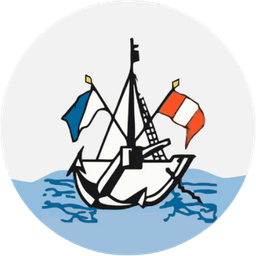

<div align="center">

  

  # 🤖 HercarIA • Asistente Virtual Oficial
  ### Instituto de Educación Superior Tecnológico Público "Hermanos Cárcamo"
  **Paita — Piura, Perú**

  <p align="center">
    <i>Orientador vocacional inteligente, consultor académico 24/7 y guía interactiva de trámites y matrículas institucionales con voz femenina neural humana y diseño estilo ChatGPT.</i>
  </p>

  <p align="center">
    <a href="https://gmph2007.github.io/HercarBOT/">
      
    </a>
    <a href="https://github.com/GMPH2007/HercarBOT/raw/main/INFORME_TECNICO_HERCARBOT.docx">
      
    </a>
    <a href="INFORME_TECNICO_HERCARBOT.md">
      
    </a>
  </p>

  <p align="center">
    
    
    
    
    
  </p>

  ---

  <h3>
    <a href="https://gmph2007.github.io/HercarBOT/">🌐 PROBAR CHATBOT EN VIVO</a>
    &nbsp;&nbsp;•&nbsp;&nbsp;
    <a href="#-c%C3%B3mo-iniciar-el-sistema">🚀 CÓMO USARLO LOCALMENTE</a>
    &nbsp;&nbsp;•&nbsp;&nbsp;
    <a href="INFORME_TECNICO_HERCARBOT.md">📑 INFORME TÉCNICO COMPLETO</a>
  </h3>

</div>

---

## 📌 Tabla de Contenidos

- [🎯 ¿Qué es HercarIA y qué problema resuelve?](#-qu%C3%A9-es-hercaria-y-qu%C3%A9-problema-resuelve)
- [🌟 Características Principales](#-caracter%C3%ADsticas-principales)
- [🎓 Oferta Formativa (Las 4 Carreras Técnicas)](#-oferta-formativa-las-4-carreras-t%C3%A9cnicas)
- [💰 Matrículas, Costos y Gratuidad de la Enseñanza](#-matr%C3%ADculas-costos-y-gratuidad-de-la-ense%C3%B1anza)
- [🧭 Test Vocacional Psicométrico](#-test-vocacional-psicom%C3%A9trico)
- [🎙️ Motor de Voz Femenina Neural y Micrófono](#️-motor-de-voz-femenina-neural-y-micr%C3%B3fono)
- [🚀 Cómo Iniciar el Sistema](#-c%C3%B3mo-iniciar-el-sistema)
- [📂 Estructura de Archivos](#-estructura-de-archivos)
- [🛠️ Stack Tecnológico](#️-stack-tecnol%C3%B3gico)
- [🏛️ Datos Institucionales de Contacto](#️-datos-institucionales-de-contacto)

---

## 🎯 ¿Qué es HercarIA y qué problema resuelve?

En la provincia de **Paita** (Región Piura), muchos egresados de educación secundaria y jóvenes aspirantes no tienen claridad sobre qué carrera técnica estudiar, o desconocen que el **I.E.S.T.P. "Hermanos Cárcamo"** es un instituto **público y gratuito**, sin pensiones mensuales privadas. 

Además, las dudas sobre trámites, validación de vouchers de Banco de la Nación en la plataforma digital institucional y fechas de matrícula suelen acumularse fuera de los horarios de atención de secretaría académica.

**HercarIA** fue creado para solucionar esta problemática ofreciendo:
1. **Orientación Vocacional Inmediata:** Un test guiado de 6 reactivos que mide intereses y habilidades, recomendando con precisión la carrera con mayor afinidad para el estudiante.
2. **Atención Continua 24/7:** Resuelve preguntas frecuentes sobre costos, admisión, trámites de Mesa de Partes y horarios al instante.
3. **Experiencia Humana y Accesible:** Voz dulce femenina en español y reconocimiento por micrófono para que personas de cualquier edad puedan interactuar hablando o escribiendo.

---

## 🌟 Características Principales

| Característica | Detalle Técnico | Beneficio para el Usuario |
| :--- | :--- | :--- |
| **Diseño Moderno Fullscreen** | Inspirado en ChatGPT con paleta cromática oficial (`#13357b`, `#2563eb`, `#f59e0b`). | Navegación intuitiva, limpia y familiar sin distracciones. |
| **Portada Hero Interactiva** | Tarjetas con sombreado de elevación suave y 6 atajos clave. | Respuestas inmediatas con un solo clic desde la pantalla de inicio. |
| **Test Vocacional Integrado** | Algoritmo psicométrico de compatibilidad porcentual. | Ayuda a los jóvenes indecisos a elegir su futuro profesional. |
| **Voz Femenina Neural** | Microsoft Edge TTS (`es-ES-ElviraNeural`) y Web Speech API. | Respuestas leídas con entonación natural, dulce y humana. |
| **Dictado por Micrófono** | Web Speech Recognition con efecto visual de ondas Ripple. | Permite consultar hablando con el manos libres activo. |
| **Control Inteligente de Audio** | Silenciado instantáneo con tecla `Escape`, foco en texto o botón. | Cero ruidos molestos o solapamientos de audio residuales. |
| **Modo Oscuro / Claro** | Variables dinámicas CSS con persistencia de preferencia. | Comodidad visual de día y de noche. |

---

## 🎓 Oferta Formativa (Las 4 Carreras Técnicas)

Todas las carreras tienen una duración de **3 años lectivos (6 ciclos académicos)** y otorgan **Título Profesional Técnico a Nombre de la Nación**, además de certificaciones modulares anuales que facilitan una pronta inserción laboral:

```
┌────────────────────────────────────────────────────────────────────────┐
│             CARRERAS PROFESIONALES TÉCNICAS DEL IESTP HERCÁR           │
├────────────────────────────────┬───────────────────────────────────────┤
│ 💻 APSTI                       │ 🚢 ANI                                │
│ Arquitectura de Plataformas    │ Administración de Negocios            │
│ y Servicios TI                 │ Internacionales                       │
│ Software, Redes, Nube y Soporte│ Comercio Exterior, Aduanas y Puertos  │
├────────────────────────────────┼───────────────────────────────────────┤
│ 📊 CONTABILIDAD                │ 🐟 DPA                                │
│ Contabilidad y Finanzas        │ Desarrollo Pesquero y Acuícola        │
│ Tributación SUNAT, Auditoría   │ Procesamiento Marino, Acuicultura y   │
│ y Gestión Empresarial          │ Prácticas en Embarcación Propia       │
└────────────────────────────────┴───────────────────────────────────────┘
```

### Tabla Comparativa de Carreras

| Carrera | Módulos Principales | Oportunidades Laborales en Paita y Piura |
| :--- | :--- | :--- |
| **APSTI** | Soporte TI, Redes y Comunicaciones, Desarrollo Web/Móvil, Servidores Cloud. | Agencias marítimas, empresas del Parque Industrial de Paita, banca y teletrabajo. |
| **ANI** | Logística internacional, despacho aduanero, gestión portuaria, comercio exterior. | Terminal Portuario Euroandinos (TPE), agencias de aduana, almacenes y exportadoras de pota/mango/uva. |
| **Contabilidad** | Contabilidad comercial y de costos, tributación SUNAT, libros electrónicos, auditoría. | Estudios contables, entidades financieras (Banco de la Nación, Cajas), municipios y empresas pesqueras. |
| **DPA** | Cultivo acuícola de conchas de abanico, navegación costera, aseguramiento de la calidad (HACCP). | Plantas procesadoras de congelados y conservas en Paita, criaderos marinos y embarcaciones industriales. |

---

## 💰 Matrículas, Costos y Gratuidad de la Enseñanza

> [!IMPORTANT]
> **El I.E.S.T.P. "Hermanos Cárcamo" es una institución pública del Estado Peruano.**
> * **NO se cobran mensualidades ni pensiones privadas.**
> * La enseñanza es **100% gratuita**.
> * El único pago es el **derecho de matrícula administrativo semestral (TUPA)**: aproximadamente **S/ 150 a S/ 250 por ciclo de 6 meses completo**.

### 📝 Cómo registrar el pago del Banco de la Nación:
1. Pagar en ventanilla o Agente MultiRed del Banco de la Nación.
2. Ingresar al portal oficial de registro: [pagos.ieshercar.edu.pe](https://pagos.ieshercar.edu.pe/).
3. Iniciar sesión con su número de **DNI**.
4. Seleccionar el concepto correspondiente, ingresar la **Fecha**, **Monto** y **Número de Operación**.
5. Adjuntar la foto o archivo escaneado del voucher legible y guardar.
6. Consultar y descargar su comprobante oficial en: [sistema.ieshercar.com/Consulta_Boletas](https://sistema.ieshercar.com/Consulta_Boletas/index.php).

---

## 🧭 Test Vocacional Psicométrico

El asistente incorpora un test vocacional especialmente desarrollado para aspirantes:
* **6 Preguntas Diagnósticas:** Evalúan afinidad por tecnología, comercio exterior, cálculos contables o ciencias marinas.
* **Algoritmo de Compatibilidad:** Al responder la sexta pregunta, calcula en tiempo real los porcentajes de afinidad de las 4 carreras.
* **Presentación con Trofeo:** Destaca la carrera principal ganadora, detalla el campo laboral en la región y brinda accesos directos para iniciar la postulación.

---

## 🎙️ Motor de Voz Femenina Neural y Micrófono

- **Voz Neural de Estudio (`es-ES-ElviraNeural`):** Generada mediante el microservicio local con Microsoft Edge TTS, brindando dicción clara, dulce y profesional.
- **Entrada por Micrófono (Speech-to-Text):** Permite al estudiante hablarle directamente al asistente. Cuenta con un efecto visual animado de ondas expansivas (*ripple effect*) durante la grabación.
- **Control Antirruido y Silenciamiento:** El audio se interrumpe de inmediato al presionar la tecla `Escape`, al hacer clic en el cuadro de texto o mediante el botón de audio en la barra superior.

---

## 🚀 Cómo Iniciar el Sistema

### Opción 1: En la Web (Acceso Inmediato sin Instalación)
Simplemente ingresa desde cualquier navegador a la versión en producción:
👉 **[https://gmph2007.github.io/HercarBOT/](https://gmph2007.github.io/HercarBOT/)**

---

### Opción 2: En Windows con 1 solo clic (Recomendada con Voz Neural de Estudio)
1. Descarga o clona este repositorio en tu computadora.
2. Haz doble clic en el archivo:
   ```cmd
   Iniciar_HercarBOT.bat
   ```
3. El lanzador arrancará el servidor local Python en segundo plano y abrirá automáticamente tu navegador en `http://localhost:8080` con la voz neural habilitada.

---

### Opción 3: Desde la Terminal (PowerShell / CMD)
```bash
# 1. Clonar el repositorio
git clone https://github.com/GMPH2007/HercarBOT.git
cd HercarBOT

# 2. Instalar dependencias de voz neural (opcional pero recomendado)
pip install edge-tts requests

# 3. Iniciar el servidor
python server.py
```
Abre tu navegador en: [http://localhost:8080](http://localhost:8080)

---

## 📂 Estructura de Archivos

```text
HercarBOT/
├── assets/
│   ├── logo-crest.png               # Insignia oficial recortada en alta definición (256x256)
│   ├── logo-hercar.png              # Logo institucional oficial
│   └── logo-iestp.png               # Escudo institucional original
├── css/
│   └── styles.css                   # Hoja de estilos (Diseño ChatGPT, animaciones ripple, Dark Mode)
├── js/
│   ├── knowledge.js                 # Base de conocimientos institucional completa y categorizada
│   ├── test_vocacional.js           # Algoritmo psicométrico interactivo con trofeo y porcentajes
│   ├── voice.js                     # Motor de audio TTS (Elvira Neural) y dictado por micrófono STT
│   └── app.js                       # Controlador principal del chat, parser NLP y formateador Markdown
├── index.html                       # Interfaz gráfica moderna en pantalla completa
├── server.py                        # Servidor HTTP en Python con endpoint /api/tts para Edge-TTS
├── Iniciar_HercarBOT.bat            # Script de lanzamiento automático para Windows
├── generar_word.py                  # Generador del informe técnico formal en formato Microsoft Word (.docx)
├── INFORME_TECNICO_HERCARBOT.docx   # Documento formal en Word listo para imprimir o presentar
├── INFORME_TECNICO_HERCARBOT.md     # Documentación técnica completa en formato Markdown
└── README.md                        # Presentación principal del proyecto en GitHub
```

---

## 🛠️ Stack Tecnológico

- **Frontend:** HTML5 Semántico, CSS3 Moderno (Custom Properties, Flexbox, Grid), JavaScript Vanilla (ES6+).
- **Backend / Microservicio:** Python 3.11, `http.server`, biblioteca `edge-tts`.
- **Iconografía:** SVG Inline de trazo uniforme (estándar Feather / Phosphor Icons a 2px).
- **Control de Versiones & Hosting:** Git, GitHub, GitHub Pages (CDN global con HTTPS).
- **Generación de Documentación Formal:** `python-docx` con paleta institucional y maquetación editorial.

---

## 🏛️ Datos Institucionales de Contacto

* **Institución:** Instituto de Educación Superior Tecnológico Público "Hermanos Cárcamo"
* **Dirección:** Av. Miguel Grau – Urb. El Parque Mz. A Lt. 01, Paita – Piura, Perú
* **Sitio Web Oficial:** [https://ieshercar.edu.pe/](https://ieshercar.edu.pe/)
* **Plataforma de Pagos:** [https://pagos.ieshercar.edu.pe/](https://pagos.ieshercar.edu.pe/)
* **Mesa de Partes Virtual:** [https://sistema.ieshercar.edu.pe/registro-tramite/](https://sistema.ieshercar.edu.pe/registro-tramite/)
* **Teléfonos:** +51 969 100 257 | (073) 251013
* **Horario de Atención:** Lunes a Viernes de 8:00 AM a 3:00 PM

---

<div align="center">
  <b>Desarrollado con dedicación por <a href="https://github.com/GMPH2007">Gerson Misael Pintado Huamán (GMPH2007)</a></b><br>
  <i>Promoviendo la educación técnica pública de calidad en Paita y el Perú 🇵🇪</i>
</div>
